# Testgids - Kampen module

Welkom, en bedankt dat je meetest! Deze gids loodst je door de nieuwe **Kampen**-module van CoachOS.

## Wat is een kamp?

Een kamp is een **meerdaagse stage** (bijvoorbeeld een paas- of zomerstage van een paar dagen) waarvoor een deelnemer zich **eenmalig** inschrijft. Dit staat helemaal los van de gewone lesreeksen:

- Een **lesreeks** is een terugkerende les, week na week, waarvoor leerlingen per moment kunnen bevestigen.
- Een **kamp** is een blok van opeenvolgende dagen. Je schrijft je in voor het hele kamp in een keer, betaalt (indien betalend) en je plek is geboekt.

Per kampdag kun je de kampuren instellen en de aanwezige trainers koppelen, elk met hun eigen uren.

## Wat willen we laten testen?

- Een kamp aanmaken via de wizard (basis, dagen en trainers, controle).
- Een kamp bekijken en bewerken als beheerder.
- Inschrijven als deelnemer via de publieke pagina (solo en groep).
- De betaalflow (cash en, met Mollie, online).
- Een cash-betaling bevestigen als coach.
- Of alle validaties en statussen kloppen (zie de testchecklist onderaan).

---

## Voordat je begint

| Wat | Waarde |
| --- | --- |
| Tester-omgeving | `<tester-omgeving-url>` |
| Lokaal (referentie) | http://localhost:5317 |
| Inloggen (beheerder) | e-mail `jan@deaces.be` - wachtwoord `Demo1234!` |

Er staan al twee demokampen klaar: **Paaskamp Gevorderden** (betalend, 120 euro) en **Gratis Padel Proefkamp** (gratis).

### Rollen

- **Beheerder (admin)**: kan kampen aanmaken, bewerken, verwijderen en betalingen bevestigen.
- **Trainer**: ziet alle kampen en details, maar **read-only**. Een trainer kan dus niets aanmaken, bewerken of verwijderen.

Houd dit verschil in het achterhoofd: als je als trainer test, hoor je geen knoppen "Bewerken", "Opslaan" of "Markeer als betaald" te kunnen gebruiken.

---

## Een kamp aanmaken (beheerder)

### Stap 0 - Naar de kampen

Log in als beheerder. In het linkermenu vind je het item **Kampen**.

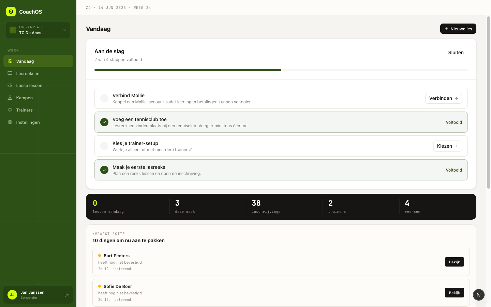
*Het dashboard na het inloggen. Links in het menu staat "Kampen".*

Klik op **Kampen**. Je ziet nu het overzicht met de bestaande kampen, hun periode, bezetting, prijs en status.

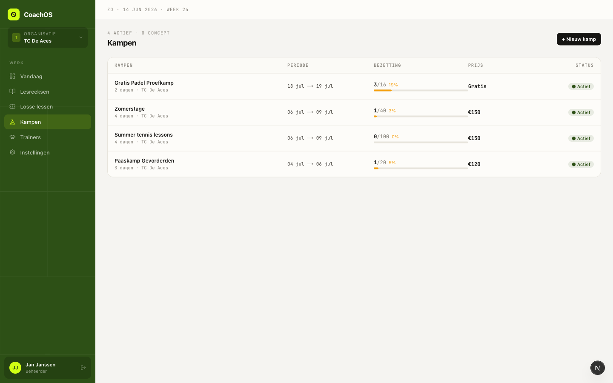
*De kampenlijst met de demokampen. Klik op een rij om het kamp te openen, of op "+ Nieuw kamp" rechtsboven.*

### Stap 1 - Basis

Klik op **+ Nieuw kamp**. De wizard heeft drie stappen, te zien in de stappenbalk bovenaan: **Basis**, **Dagen & trainers** en **Controle**.

Vul in stap 1 de basisgegevens in:

- **Naam** (verplicht): de naam van het kamp, bijvoorbeeld "Testkamp".
- **Omschrijving**: extra info die deelnemers op de inschrijfpagina zien.
- **Club** (verplicht): kies de tennisclub waar het kamp plaatsvindt.
- **Niveau**: optioneel niveau (bijvoorbeeld Gevorderd), of laat het op "Geen niveau".
- **Prijs** (verplicht): bedrag in euro. **0 = gratis** (dan is er geen betaalstap).
- **Max. deelnemers**: het maximaal aantal plekken. Leeg laten = onbeperkt.
- **Startdatum** en **Einddatum** (verplicht): de eerste en laatste kampdag.
- **Inschrijfdeadline** (verplicht): tot wanneer deelnemers kunnen inschrijven.

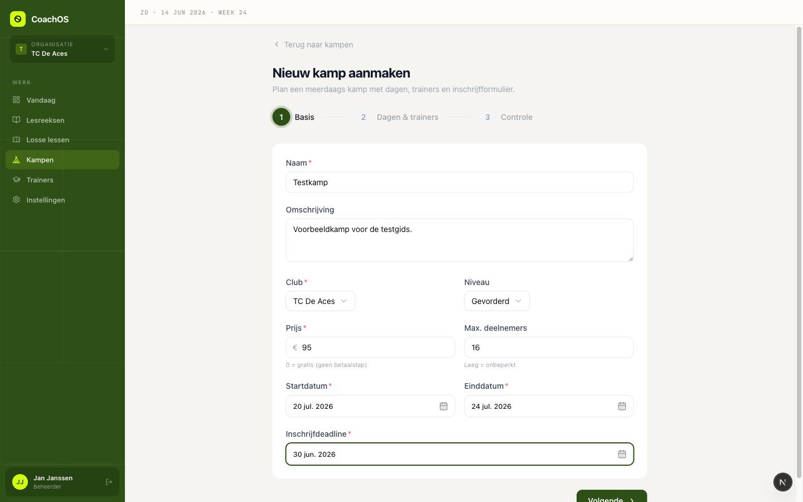
*Stap 1 met voorbeeldgegevens ingevuld.*

> **Let op de einddatum.** De einddatumkalender blokkeert alle dagen voor de startdatum. Je kunt dus nooit een einddatum kiezen die voor de startdatum ligt. Test dit gerust: kies eerst een startdatum, open dan de einddatumkalender en je ziet dat de eerdere dagen grijs en niet klikbaar zijn.

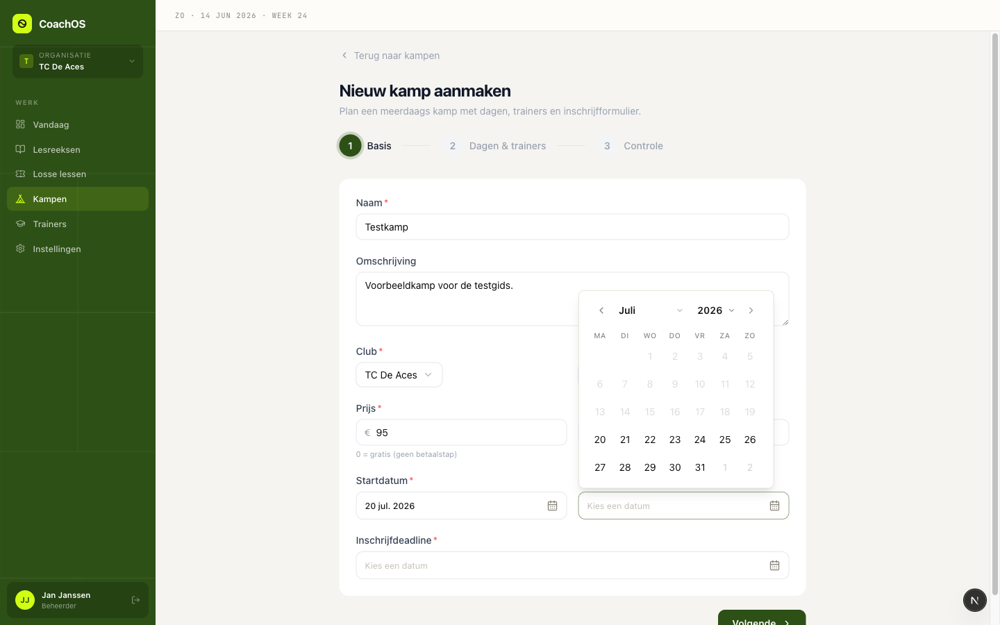
*De einddatumkalender: de dagen voor de gekozen startdatum (20 juli) zijn grijs en uitgeschakeld.*

Klik op **Volgende**.

### Stap 2 - Dagen & trainers

Op basis van de start- en einddatum genereert CoachOS automatisch een kaart per kampdag. Per dag kun je:

- De **kampuren** instellen (van - tot), bijvoorbeeld 09:00 tot 16:00. Dit zijn de algemene uren van die dag.
- Een of meer **trainers** toevoegen via de keuzelijst "Trainer toevoegen".
- Per trainer **hun eigen uren** instellen. Zo kun je bijvoorbeeld een trainer in de voormiddag (09:00 - 12:00) en een andere in de namiddag (12:00 - 16:00) laten werken.
- Een trainer weer verwijderen met het prullenbak-icoon.

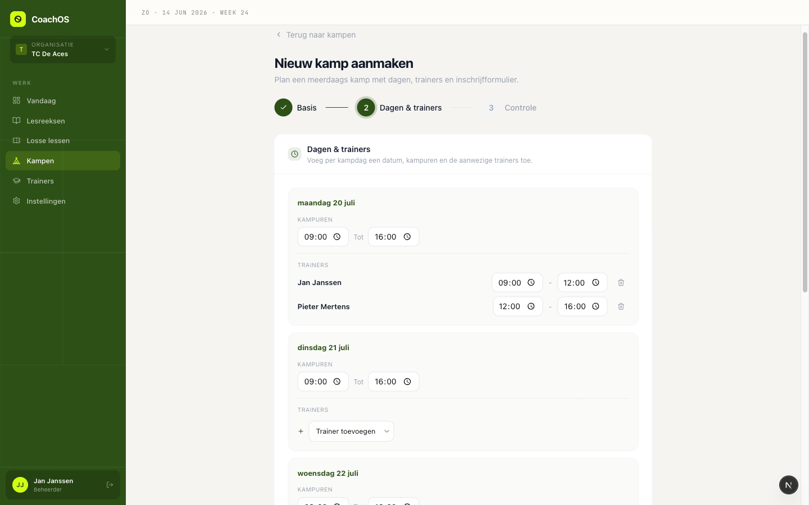
*Stap 2: elke kampdag heeft kampuren en kan eigen trainers met eigen uren krijgen. Hier staan op de eerste dag twee trainers met verschillende shifts.*

Klik op **Volgende**.

### Stap 3 - Controle

In stap 3 zie je een overzicht van alles wat je hebt ingevuld: naam, prijs, periode, niveau, club, max. deelnemers, inschrijfdeadline, plus de dagen met hun trainers en uren. Controleer dit goed.

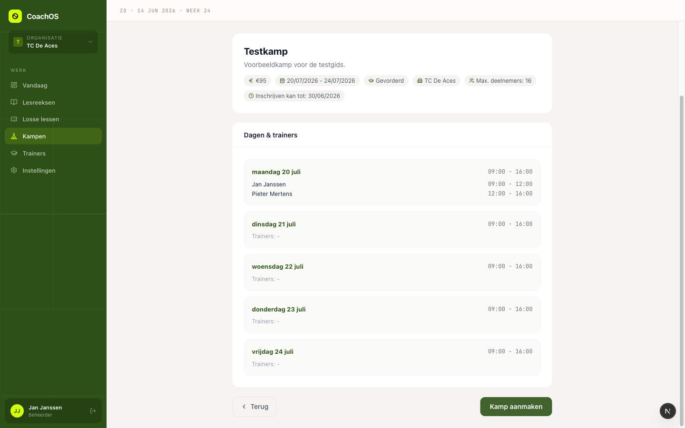
*Stap 3: het controleoverzicht voor je het kamp aanmaakt.*

Klopt alles? Klik op **Kamp aanmaken**. Het kamp staat nu in de lijst.

---

## Een kamp bekijken en bewerken

Klik in de kampenlijst op een kamp om de detailpagina te openen (bijvoorbeeld "Paaskamp Gevorderden").

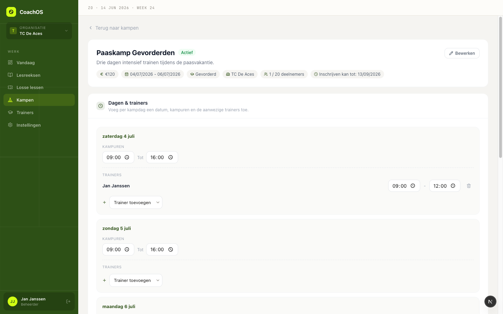
*De detailpagina als beheerder: infokaart bovenaan, daaronder de kaart "Dagen & trainers" waar de trainers met **naam** worden getoond.*

Op de detailpagina vind je:

- Een **infokaart** met prijs, periode, niveau, club, bezetting en inschrijfdeadline, plus een knop **Bewerken**.
- De kaart **Dagen & trainers**: hier zie je per dag de kampuren en de gekoppelde trainers, getoond met hun **naam** (dus geen technische id's). Je kunt uren aanpassen, trainers toevoegen of verwijderen en daarna op **Opslaan** klikken.
- Het **Inschrijfformulier**: hier voeg je extra vragen toe die deelnemers bij inschrijving beantwoorden (vrije tekst, meerkeuze, ja/nee). De vaste velden (voornaam, achternaam, e-mail, telefoon) staan er altijd.
- De **Inschrijvingen**: de lijst met deelnemers en hun betaal- en bevestigingsstatus.
- Onderaan **Kamp verwijderen** (alleen mogelijk als er geen actieve inschrijvingen zijn).

### Verschil beheerder tegenover trainer

- Een **beheerder** ziet en gebruikt alle knoppen hierboven.
- Een **trainer** ziet dezelfde informatie, maar **read-only**: geen "Bewerken", geen "Opslaan", geen "Markeer als betaald" en geen "Kamp verwijderen". Test dit door met een trainer-account in te loggen en te controleren dat die knoppen ontbreken.

---

## Inschrijven als deelnemer (publiek)

Elke deelnemer schrijft zich in via een **publieke pagina**, zonder account. Je vindt de link via de knop **Inschrijflink kopiëren** op de detailpagina. De link ziet eruit als `/camp/{campId}`.

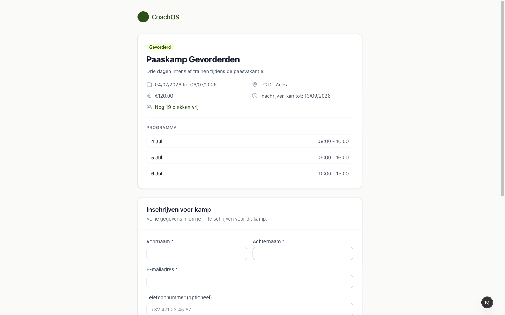
*De publieke inschrijfpagina: links de kampinfo en het programma, rechts het inschrijfformulier.*

Op deze pagina:

- Links zie je de kampinfo (datums, club, prijs, inschrijfdeadline, vrije plekken) en het programma per dag.
- Rechts vul je je gegevens in: voornaam, achternaam, e-mailadres en (optioneel) telefoonnummer, plus eventuele extra vragen die de coach heeft toegevoegd.
- Bij **Type inschrijving** kies je **Solo** (jezelf) of **Groep** (meerdere deelnemers in een keer).

> **Groepsinschrijving**: bij een groep schrijf je meerdere deelnemers in een keer in. Er is dan **een** registratie en **een** betaling voor de hele groep, niet per persoon.

Klik op **Inschrijven** om door te gaan naar de betaalstap (bij een betalend kamp) of meteen naar de bevestiging (bij een gratis kamp).

> **Tip bij testen**: gebruik een uniek e-mailadres per inschrijving, bijvoorbeeld `tester+iets@example.com`. Een tweede inschrijving met **hetzelfde** e-mailadres voor hetzelfde kamp wordt namelijk geweigerd (zie de checklist).

---

## Betaling

Wat je na het inschrijven ziet, hangt af van het kamp en de Mollie-koppeling.

### Betalend kamp zonder Mollie (huidige situatie)

Zonder gekoppeld Mollie-account toont de betaalpagina **alleen de optie "Cash betalen"**. Je betaalt dan ter plaatse en je plek wordt gereserveerd in afwachting van je betaling.

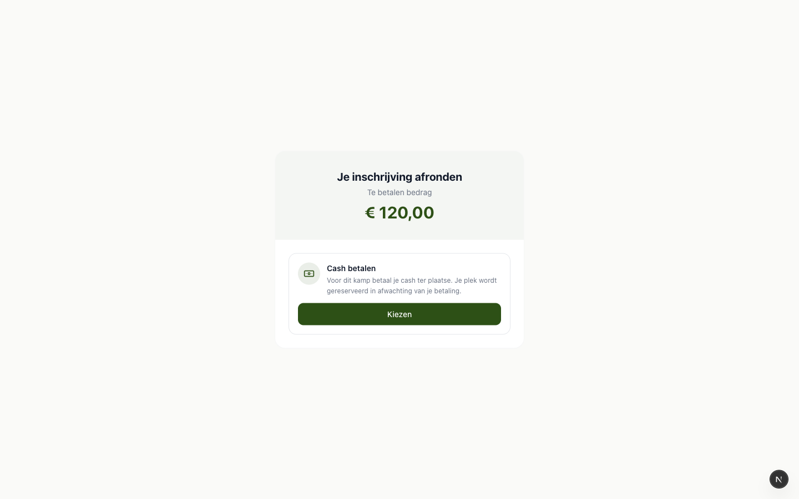
*De betaalpagina toont het te betalen bedrag en enkel de cash-optie (Mollie is niet gekoppeld).*

Klik op **Kiezen** bij Cash. Je krijgt een bevestigingsscherm: je inschrijving is geregistreerd, je betaalt cash ter plaatse en je plek is gereserveerd tot de club je betaling bevestigt.

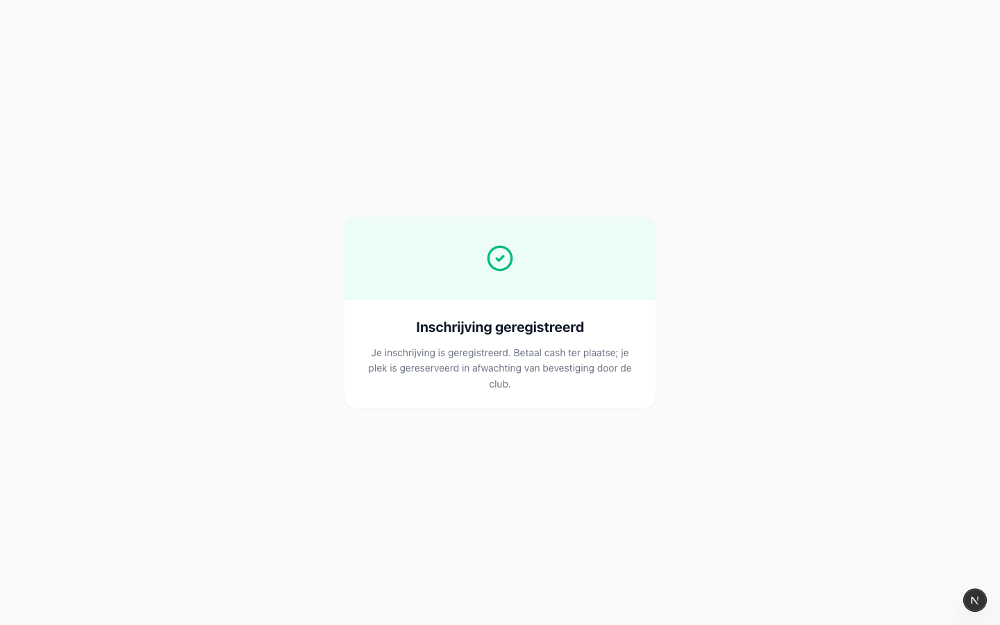
*Bevestiging na het kiezen van cash: de inschrijving is geregistreerd, betaling volgt ter plaatse.*

### Betalend kamp met Mollie

Is er wel een Mollie-account gekoppeld, dan krijgt de deelnemer op de betaalpagina de **keuze** tussen cash en online betalen (Bancontact of iDEAL). Bij online betalen rondt de deelnemer de betaling af via Mollie.

### Gratis kamp

Bij een gratis kamp (prijs = 0) is er **geen betaalstap**. Na het inschrijven is de deelnemer meteen bevestigd.

---

## Betaling bevestigen (beheer)

Een cash-inschrijving blijft "in afwachting" tot de coach ze bevestigt. Ga als beheerder terug naar de detailpagina van het kamp en scrol naar **Inschrijvingen**.

De cash-inschrijving staat er met de status **"Cash - wacht op betaling"** en **"Betaling in afwachting"**, met een knop **Markeer als betaald**.

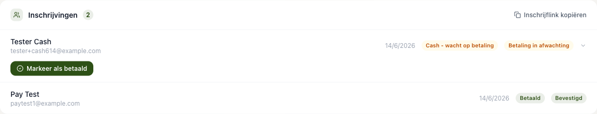
*De cash-inschrijving wacht op betaling. Met "Markeer als betaald" bevestigt de coach de betaling.*

Klik op **Markeer als betaald**. De inschrijving krijgt nu de status **Betaald** en wordt **Bevestigd**. De deelnemer telt mee in de bezetting.

---

## Waar moet je op letten? (testchecklist)

Loop deze punten af en vink aan wat klopt:

- [ ] De einddatum kan **niet** voor de startdatum gekozen worden (eerdere dagen zijn grijs en geblokkeerd).
- [ ] Trainers worden overal getoond met hun **naam**, niet met een technische id.
- [ ] Je kunt **per dag per trainer** aparte uren instellen (bijvoorbeeld voormiddag tegenover namiddag).
- [ ] Een **gratis** kamp (prijs 0) heeft **geen** betaalstap; een **betalend** kamp wel.
- [ ] Cash-flow: een cash-inschrijving staat eerst op **wacht op betaling**, na **Markeer als betaald** wordt ze **Betaald** en **Bevestigd**.
- [ ] **Groepsinschrijving**: meerdere deelnemers, maar **een** registratie en **een** betaling voor de hele groep.
- [ ] **Capaciteit**: bij het bereiken van max. deelnemers is het kamp **volzet** en kan er niemand meer inschrijven.
- [ ] **Dubbele inschrijving**: een tweede inschrijving met **hetzelfde e-mailadres** voor hetzelfde kamp wordt geweigerd.
- [ ] **Inschrijfdeadline**: na de deadline kan er niet meer ingeschreven worden.
- [ ] **Rollen**: een **beheerder** kan bewerken en verwijderen, een **trainer** ziet alles read-only (geen bewerk-, opslaan- of verwijderknoppen).
- [ ] **Bevestigingsmails**: na een inschrijving en na bevestiging worden de juiste e-mails verstuurd. Lokaal lees je die in smtp4dev op http://localhost:3001.

---

## Bekende beperkingen

- **Online betalen vereist een Mollie-koppeling.** Zolang Mollie niet gekoppeld is, toont een betalend kamp enkel de cash-optie.
- **Cash blijft "in afwachting"** tot de coach de betaling bevestigt via "Markeer als betaald". Pas daarna is de inschrijving betaald en bevestigd.
