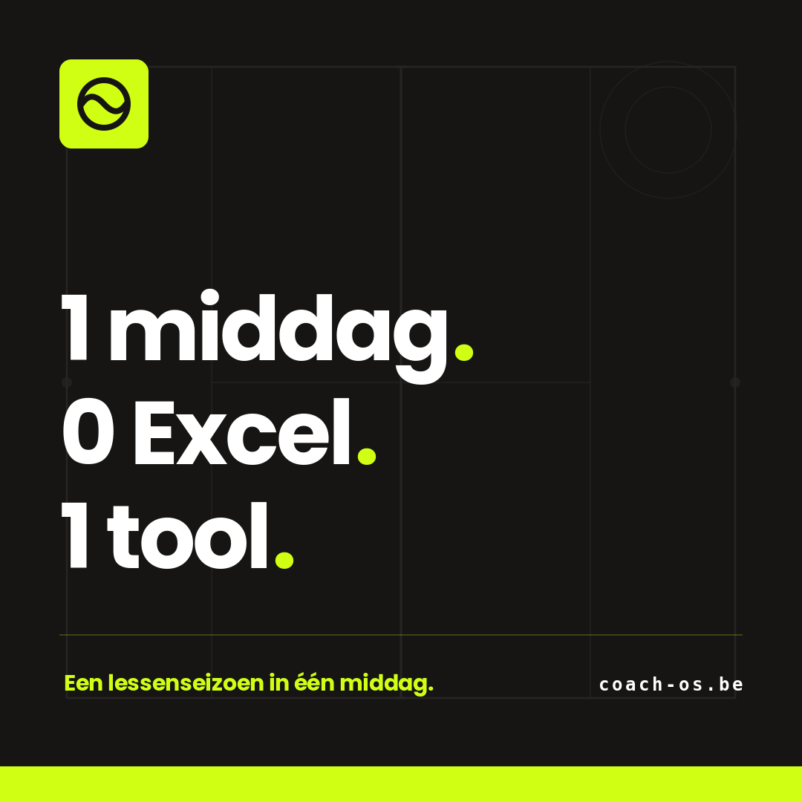
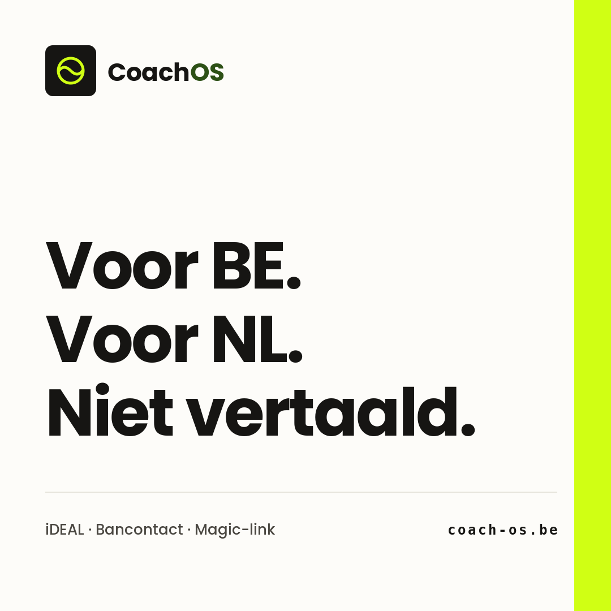
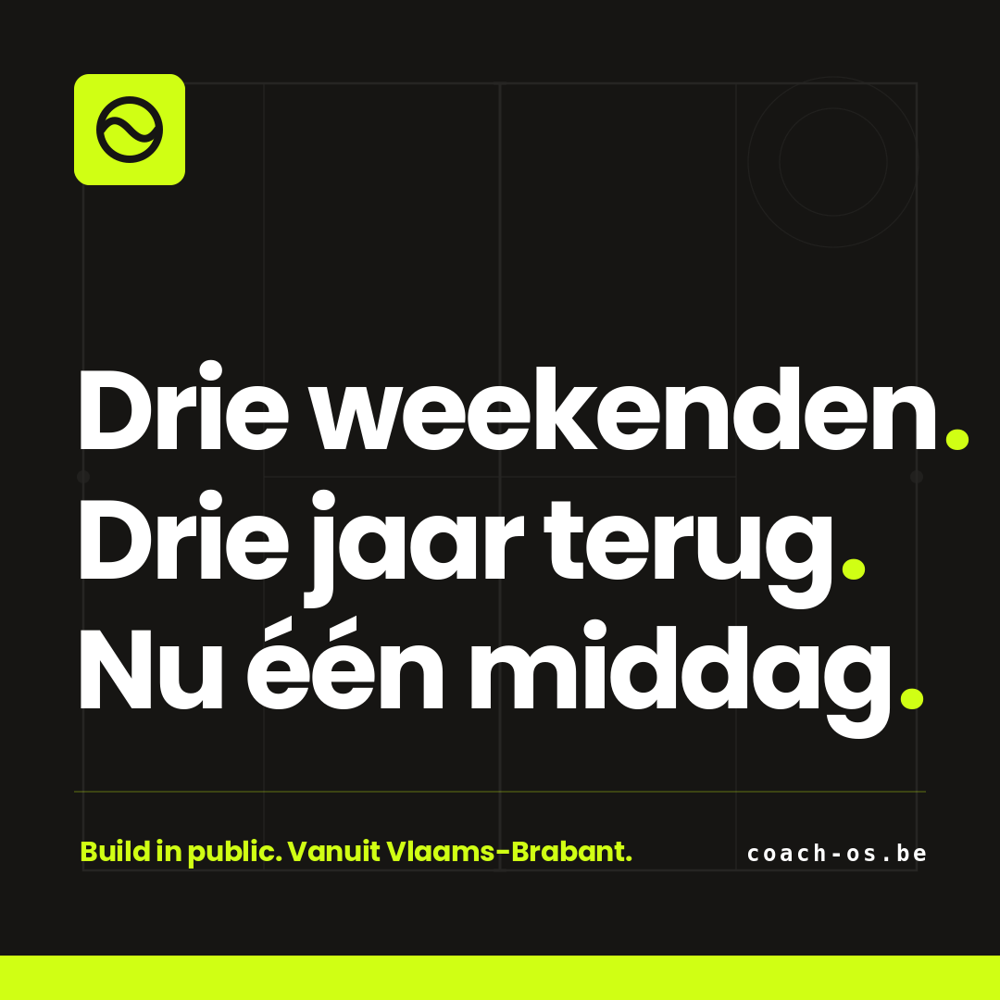

# CoachOS Social — Week 01

Open this file Mon/Wed/Fri morning. Copy the caption, save the image, post manually.

**Posting times:**
- Instagram: **07:30 CET**
- LinkedIn: **08:30 CET** (CoachOS company page)

---

## MAANDAG

### Visual



`drafts/exports/week-01-mon-card.png` — right-click → Save Image, then upload to both platforms.

---

### LinkedIn caption (08:30)

```
Drie weekenden Excel om één lessenseizoen rond te krijgen.

80 leerlingen. 12 banen. 4 trainers. 6 niveaugroepen.

En dan ontdek je dat Sven en Marit allebei alleen op donderdag kunnen — maar niet samen.

Dit is wat hoofdtrainers in BE en NL elk seizoen opnieuw doen. Naast lesgeven. Naast coaching. Naast eigen training.

CoachOS doet het in één middag.

Eén lessenreeks aanmaken. Eén link naar je spelers. De auto-planner verdeelt inschrijvingen, lost conflicten op, en stuurt iDEAL- en Bancontact-betaallinks. Spelers maken geen account aan — alles via magic-link.

1 middag · 0 Excel · 1 tool

Demo? Link in de comments.
```

**First comment to add immediately after posting:**

```
→ coach-os.be
```

---

### Instagram caption (07:30)

```
3 weekenden Excel.
Of 1 middag CoachOS.

Tennis- of padelclub plannen kan ook gewoon in één middag:

→ 1 lessenreeks aanmaken
→ 1 link delen met je spelers
→ Auto-planner doet de rest

Inschrijvingen, betalingen via iDEAL + Bancontact, magic-links — geregeld.

Voor clubs in BE & NL.

Link in bio: coach-os.be
```

**Hashtags (add to caption or first comment):**

```
#tennisclub #padelclub #padelbelgie #padelnederland #tennisnederland #lesplanning #clubmanagement #benelux #padel #tennis
```

---

## WOENSDAG

### Visual



`drafts/exports/week-01-wed-card.png`

---

### LinkedIn caption (08:30)

```
Internationale planning-tools werken prima. Tot je Bancontact wilt gebruiken.

TeamUp. Playtomic. ClubMaster. Allemaal solide producten. Allemaal niet gebouwd voor de Benelux.

→ Bancontact-betalingen? Soms via een omweg, vaak helemaal niet.
→ iDEAL? Als je geluk hebt, of via een dure plugin.
→ Spelers zonder account laten inschrijven? Bijna nooit een optie.
→ Auto-planner voor lessenreeksen? Meestal niet — het zijn baanboekers, geen lesplanners.

CoachOS doet één ding: lessenseizoenen plannen voor tennis- en padelclubs in BE en NL. Met de betaalmethoden die hier daadwerkelijk gebruikt worden.

Niet beter omdat het meer doet. Beter omdat het minder doet — en dat ene goed.

Voor BE. Voor NL. Niet vertaald.
```

**First comment:**

```
→ coach-os.be
```

---

### Instagram caption (07:30)

```
Internationale tools voor padelclubs?
Werken prima — tot je Bancontact wilt gebruiken.

CoachOS is anders gebouwd:

→ iDEAL + Bancontact als first-class
→ Geen accounts voor spelers
→ Auto-planner voor lessen, niet baanboeking

Voor BE. Voor NL. Niet vertaald.

coach-os.be
```

**Hashtags:**

```
#padelclub #tennisclub #padelbelgie #padelnederland #lesplanning #benelux #saasnl #buildinpublic #padel #tennis
```

---

## VRIJDAG

### Visual



`drafts/exports/week-01-fri-card.png`

---

### LinkedIn caption (08:30)

```
Drie jaar geleden gaf ik tennislessen in Vlaams-Brabant. Elk seizoen verloor ik drie weekenden aan Excel.

Leerlingen verdelen. Beschikbaarheden uitvragen. Conflicten oplossen tussen banen, trainers en niveaugroepen. Planningen die om 22u 's avonds nog instortten omdat één ouder een verkeerde tijd had doorgegeven.

Op een woensdag dacht ik: dit kan toch niet kloppen.

Dus begon ik CoachOS te bouwen. Een tool die in één middag doet wat mij drie weekenden kostte.

Inmiddels gebruiken clubs in BE en NL het voor hun seizoensplanning. De auto-planner verdeelt de inschrijvingen. iDEAL en Bancontact regelen de betalingen. Spelers loggen niet in — ze klikken op een magic-link in hun mail.

Elke week post ik hier wat we leren over een product bouwen voor een niche. Volg deze pagina als je nieuwsgierig bent hoe we groeien.

#buildinpublic #saas #padelbelgie #tennisnederland
```

**First comment:**

```
→ coach-os.be
```

---

### Instagram caption (07:30)

```
Drie weekenden Excel per seizoen.

Tot ik op een woensdag dacht: dit kan toch niet kloppen.

Zo begon CoachOS. Niet als startup. Als interne tool om mijn eigen tennislessen te plannen.

Inmiddels in heel BE en NL.

→ coach-os.be
```

**Hashtags:**

```
#buildinpublic #saas #padelclub #tennisclub #padelbelgie #padelnederland
```

---

## After this week

Tell Claude "draft week 02" and we'll generate the next set with three new content angles. The full library of past drafts stays in `drafts/` for reference and reuse.
